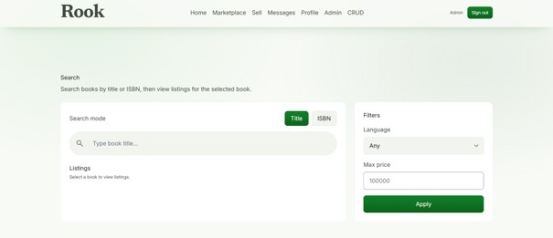
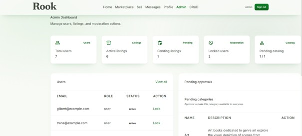
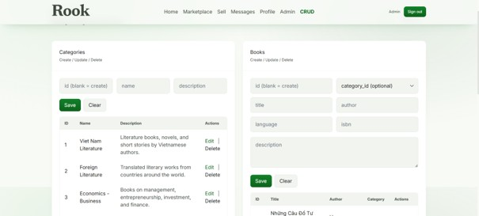
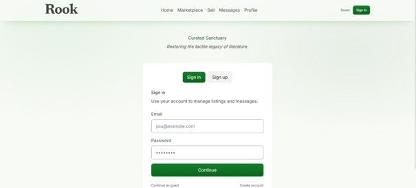
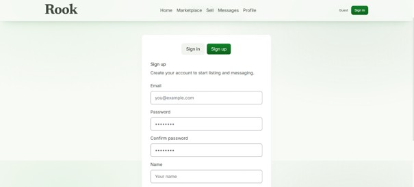

# Rook 📚

A full-stack used-book marketplace web application designed for a university/graduation project. Users can buy, sell, search for second-hand books, chat in-context with sellers, and manage listings through an admin approval flow. The UI ships as a mounted FastAPI-served single-page app (plus multi-page fallback) and supports two data layers: local FastAPI + SQLite/Postgres, or a Supabase-powered PostgREST/Auth/Storage mode.

---

## Screenshots

> 📸 All screens captured from the running app at http://localhost:8000/ui/ (Material 3 inspired light-green palette).
> Click any image to open full-size.

| | |
|---|---|
| **Home** — hero banner with `homebackground.webp`, sticky nav, CTAs to Marketplace / Start Selling. | **Marketplace** — fixed-height card grid, dynamic category dropdown (real DB), min/max price filter. Owned listings show `Edit`; others show context-aware `Message`. |
| [](screenshots/Home.jpg) | [](screenshots/Marketplace.jpg) |
| **Listing Detail** — image gallery, book metadata, seller card with avatar, profile link, Message button. | **Search** — title / ISBN mode, type-ahead suggestions, language + max-price filters applied per-book. |
| [](screenshots/ListingDetail.jpg) | [](screenshots/Search.jpg) |
| **Messages** — per-listing conversation threads, listing-attachment chip, peer search, block list. | **Profile** — public + self-profile, member-since, badges, name/avatar editor, “Seller” active-listings preview. |
| [](screenshots/Messages.jpg) | [](screenshots/Profile.jpg) |
| **Seller Dashboard** — total / active counters, quick actions (Edit, Mark sold). | **Admin Dashboard** — stats cards, user lock/unlock, pending books/categories/listings approval tables. |
| [](screenshots/SellerDb.jpg) | [](screenshots/AdminDb.jpg) |
| **Admin CRUD** — direct create/update/delete of categories & books (admin-only shell page). | **Sign In / Sign Up** — single tabbed page. Demo mode: sign up auto-logs in immediately. |
| [](screenshots/CRUD.jpg) | [](screenshots/SignIn.jpg) · [](screenshots/SignUp.jpg) |

```
screenshots/
├── Home.jpg
├── Marketplace.jpg
├── ListingDetail.jpg
├── Search.jpg
├── Messages.jpg
├── Profile.jpg
├── SellerDb.jpg
├── AdminDb.jpg
├── CRUD.jpg
├── SignIn.jpg
└── SignUp.jpg
```

---

## Features

### Authentication & Profiles
- Sign in / Sign up w/ email + password
- Supabase Auth + refresh-token session (mode Supabase) or local JWT (mode local FastAPI)
- `profiles`/`users` with name, email, avatar, member-since, role (user / admin), status (active / banned)
- Sign-up auto-logs in for demo convenience

### Marketplace Browsing
- Category filter
- Price filter min / max)
- Search by book title or ISBN
- Fixed-height listing cards w/ lazy image loading
- Lighthouse-friendly image priorities (first 3 eager + high fetchPriority)

### Listings & Books
- Create / Edit / Mark sold
- Multi-image uploads (Supabase Storage)
- Book & category creation with admin approval
- Listing ownership: `Message` vs `Edit` context buttons on cards

### Messaging (Listing-scoped)
- Send messages are **per listing** (not just per user-user pair) — each conversation has a clear transaction context
- Auto-searches conversation builder: `(sender, receiver, listing_id)` grouping)
- Blocked user filter (local storage) block/unblock UX
- Attachment chip w/ click → jump to listing

### Seller workspace
- Seller dashboard: count stats
- My listings (CRUD: Edit / Mark sold

### Admin workspace
- Approve books
- Approve categories
- Approve listings
- Lock / unlock users
- Admin-only CRUD page for books/categories bulk admin-page/delete

### UI/UX
- SPA hash router `#/...
- SPA route params read via `normalizeRoute`, `rewriteLinks`
- SPA and multi-page dual-mode fallback
- Same-origin mounted UI at `/ui/*` (no CORS)
- Tailwind CDN + fallback CSS utilities for spacing / palette
- Lighthouse optimizations: preconnect/preload fonts, GZip, cache headers, inline critical CSS, prerender Home

---

## Architecture

### High-level diagram
```
                ┌──────────────────────┐
                │   User / Guest  │
                └────────┬─────────────┘
                         │
                ┌────────▼─────────────┐
                │     Browser     │
                │  Rook UI (SPA)│
                └┬──────────────┬──────┘
                 │              │
     GET /ui/*   │              │ POST /auth/v1 /rest/v1 /storage/v1
     GET /config │              │
         ┌──────▼──────┐  ┌──────▼────────────────────┐
         │   FastAPI    │  │         Supabase           │
         │ (mounts UI +  │  │  Auth • PostgREST • Storage  │
         │  /config)     │  └────────────┬────────────────┘
         └─────────────┘                 │
                 │              │
                 │        ┌─────▼──────────────┐
                 │        │    Postgres       │
                 │        │ (profiles, books,│
                 │        │ listings, messages, │
                 │        │ listing_images …)   │
                 │        └────────────────────┘
                 │
        ┌────────▼──────────┐
        │ SQLite /    │
        │ Postgres  │
        │ (local mode)│
        └────────────────┘
```

### Data model (core)
- `users`/`profiles` (UUID or int PK)
- `categories` — `id, name, desc, is_approved, created_by
- `books` — `id, title, author, category_id, language, isbn, description, is_approved, created_by
- `listings` — `id, book_id FK books, seller_id FK users, price, condition, status(available/sold), is_active`
- `listing_images` — `id, listing_id FK listings, url`
- `messages` — `id, listing_id FK listings (nullable), sender_id FK users, receiver_id FK users, body, is_read, created_at`

### Why messages are per-listing
Each chat thread is uniquely identified by `(buyer_id, seller_id, listing_id)` so that multiple inquiries about multiple listings never mix into the same vague conversation. This makes moderation, read receipts, and “what was this chat about?” trivial.

### Layers / codebase layout
```
d:\Rook\
├── backend\              FastAPI application
│   └── app\
│       ├── routers\    auth, books, categories, listings, messages, users
│       ├── models.py SQLAlchemy models
│       ├── schemas.py  Pydantic
│       ├── security.py passwords / tokens (JWT (bcrypt)
│       ├── deps.py  request deps
│       └── main.py    entry, mounts /ui, exposes /config
├── database\           01_schema.sql, 02_auth_setup.sql, 03_mockdata.sql, supabase_setup.md
├── diagram\          PlantUML diagrams
├── frontend\
│   ├── pages\          static pages for multi-page mode & SPA templates
│   └── assets\
│       ├── css\       theme.css, pages.css
│       ├── img\       homebackground.webp
│       └── js\
│           ├── api\     client.js, auth.js, listings.js, books.js, messages.js, users.js (was api.js)
│           ├── pages\  per-page init modules
│           ├── spa.js hash SPA router + CRUD shell
│           ├── state.js  token/supabase/config localStorage
│           └── ui.js   qs, setText, fmtVnd, fmtDateTime, setStatus
└── tests\            pytest (backend: pytest tests/test_api.py
```

---

## Tech Stack

### Frontend
- HTML5 + Vanilla JS (ES modules)
- TailwindCSS (CDN w/ `defer`)
- Tailwind 4 tokens M3-inspired palette + custom spacing via fallback CSS
- Material Symbols Outlined (lazy-loaded only when a page uses them)
- SPA hash router (`#/routes + dual-mode multi-page HTML templates

### Backend
- Python 3.12
- FastAPI 0.109
- Uvicorn (standard)
- SQLAlchemy 2.0 + Pydantic 2.x
- passlib + bcrypt + python-jose
- Starlette GZipMiddleware + custom cache headers for static
- Optional: Supabase (FE can drive Supabase Auth • PostgREST • Storage + RLS

### Infrastructure
- Same-origin static UI mounted at `/ui` (no CORS)
- SQLite (default, local mode
- Postgres (+psycopg2-binary) + optional Docker Compose
- Storage: Supabase Storage bucket `listing-images`
- Testing: pytest + httpx (backend), lightweight logic tests (frontend)

---

## Setup

### Prerequisites
- Windows 10/11
- Python 3.12 (recommended; avoid 3.14 until wheels catch up)
- (Optional) Docker Desktop for Postgres container
- (Optional) Supabase project for Supabase mode

### Quick start — local (SQLite default)
1. Clone repo & install deps

```bash
cd d:\Rook
py -3.12 -m pip install -r requirements.txt
```

2. Seed if you want seed data automatically, run:

```bash
cd backend
py -3.12 ..\backend\scripts\seed_db.py
```

3. Run backend + UI:

```bash
cd backend
py -3.12 -m uvicorn app.main:app --reload --host 0.0.0.0 --port 8000
```

4. Open browser to:

- **SPA UI** : http://localhost:8000/ui/

The backend mounts the frontend at `/ui/*` from the resolved `frontend/` folder and redirects `/` → `/ui/`.

### Quick start — Postgres via Docker
1. Ensure Docker Desktop is running.

```bash
cd d:\Rook
docker compose up --build
```

2. Open http://localhost:8000/ui/

### Supabase mode
1. Fill in `.env.supabase (or env vars):

```env
ROOK_SUPABASE_REST_URL=https://<project-ref>.supabase.co/rest/v1
ROOK_SUPABASE_ANON_KEY=<anon key>
```

2. Start backend with those env vars loaded. The endpoint returns them down to FE via `/config` and FE will auto-switch to Supabase Auth / PostgREST / Storage.

2. Run the SQL in `database/supabase_setup.md` (schema + triggers + RLS + storage bucket policy) on your Supabase SQL editor.

3. Open http://localhost:8000/ui/

### Test users (mock seed)
The seed_data (local default mock users (default credentials (mock seed.sql seed):
- admin@example.com / admin123 (role admin
- seller@example.com / seller123
- buyer@example.com / buyer123

---

## Demo Scripts
| Path (route `/ui/#/marketplace

| Name | Email | Password | Role |Notes|
|------|---|---|---|---|---|
|Home|`#/home|——|——||
|Marketplace|`#/marketplace|
|Search|`#/search|title/ISBN|search, language / max price|
|Sign in/up|`#/signin|tabs, auto-login||
|Create listing|`#/managelisting (blank, or ?id=..
|Listing detail|`#/listing?id=12|
|Messages|`#/messages|
|My profile|`#/profile (self)|`#/profile?id=<uuid> (others)
|Seller dashboard|`#/seller-dashboard|
|Admin dashboard|`#/admin-dashboard|
|Admin CRUD (books/cats)|`#/crud|

### Demo: end-to-end buyer/seller flow (1–2 min)
1. Sign in as `seller@example.com` → Seller Dashboard → Start Selling → create book + listing
2. Sign out → sign in `buyer@example.com` → Marketplace → click a listing → Message
3. Seller signs back in → Messages → inbox contains a per-listing conversation thread
4. Sign in as admin → Admin → approve pending books/categories/listings + lock/unlock users

---

## Testing

### Backend tests (pytest)
```bash
cd d:\Rook
py -3.12 -m pytest tests/ -v
```

### Frontend logic tests (lightweight, no build step)
A tiny Node/browser harness lives at `frontend/tests/`:

```bash
cd d:\Rook\frontend\tests
node run.mjs
```

Coverage covers pure logic helpers without a framework):
- `ui.js` formatters (`fmtVnd`, `fmtDateTime`, `setText`
- `state.js` token/config (mocked storage)
- Messaging conversation builder (grouping per listing + blocked users)
- Search debounce / conversation-key normalization

No Jest/Vitest required — zero dependencies.

---

## Performance & Lighthouse
The app ships with a checklist already applied (see `lighthouse_optimizations.md`):
- `GZipMiddleware(minimum_size=500B
- Cache-Control: 1h for `/ui/assets/*` assets`, no-cache for HTML shells
- Preconnect + preload fonts
- Favicon inline (no 404)
- SPA prerender Home HTML (`data-prerender="home"` — avoids early fetch home.html
- Image lazy loading + eager / fetchPriority high for 1st 3 cards
- Deferred Tailwind + Tailwind CSS defer refresh after route injection + fallback utilities
- Material Symbols injected only when a page uses `.material-symbols-outlined
- Supabase config boot via `/config` once.

---

## License / Credits
This project icon: “Rook” — 🦅 — a graduation project full-stack used-book marketplace. UI palette inspired by Material 3 + a soft green/teal primary. Background hero image lives at `frontend/assets/img/homebackground.webp`.
