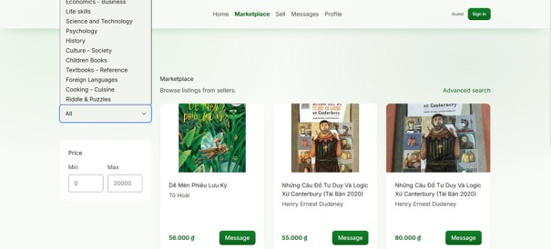
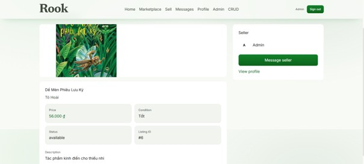
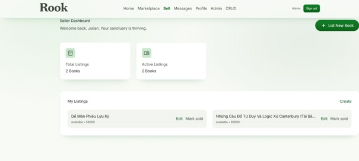
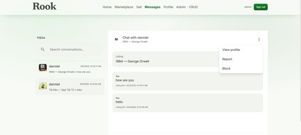
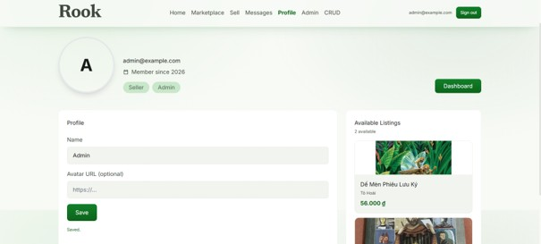
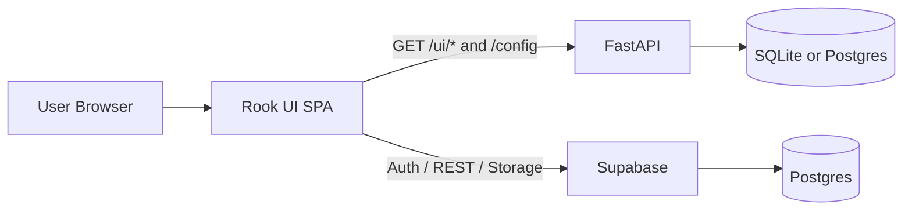

# Rook - Used Books Marketplace

> A full-stack web marketplace for buying and selling used books.

## Screenshots

Click any image to view it full size.

| Home | Marketplace |
| --- | --- |
| [](screenshots/Home.jpg) | [](screenshots/Marketplace.jpg) |

| Listing Detail | Seller Dashboard |
| --- | --- |
| [](screenshots/ListingDetail.jpg) | [](screenshots/SellerDb.jpg) |

| Messages | Profile |
| --- | --- |
| [](screenshots/Messages.jpg) | [](screenshots/Profile.jpg) |

Additional screens: [Search](screenshots/Search.jpg), [Admin Dashboard](screenshots/AdminDb.jpg), [Admin CRUD](screenshots/CRUD.jpg), [Sign In](screenshots/SignIn.jpg), [Sign Up](screenshots/SignUp.jpg)

## Overview

**Rook** is a portfolio-focused full-stack marketplace where buyers can discover second-hand books, sellers can publish and manage listings, and admins can moderate the platform through approval and user-management workflows.

The project uses a **FastAPI backend** and a **mounted vanilla JavaScript SPA frontend**, so the UI is served from the same origin as the API. It also supports two data modes: a local FastAPI database flow for development, and a **Supabase-backed mode** for Auth, PostgREST, Storage, and Postgres.

## Features

### Buyer
- Browse book listings
- Search by title or ISBN
- Filter by category and price
- View detailed listing pages
- Message sellers in listing-specific conversations

### Seller
- Create listings
- Edit listings
- Upload listing images
- Manage active listings
- Mark items as sold
- Track conversations with buyers

### Admin
- Manage users
- Manage categories
- Moderate listings
- Approve books and categories
- Lock and unlock accounts

### UX and Platform
- Custom SPA routing with multi-page fallback
- Responsive UI optimized for desktop and laptop usage
- Loading, error, and empty states across key pages
- Lazy-loaded marketplace images
- Same-origin frontend mounting at `/ui/*`

## Tech Stack

| Category | Stack |
| --- | --- |
| Frontend | HTML5, CSS3, Vanilla JavaScript (ES Modules), Tailwind CSS |
| Backend | FastAPI, Uvicorn, SQLAlchemy, Pydantic |
| Authentication | JWT, passlib, python-jose, Supabase Auth |
| Database | SQLite / PostgreSQL / Supabase Postgres |
| Storage | Supabase Storage |
| Testing | pytest, httpx, lightweight frontend logic tests |
| DevOps | Docker, Docker Compose, GitHub Actions |

## Architecture



**Key architecture decisions**
- The frontend is mounted directly by FastAPI, which keeps the app same-origin and avoids CORS complexity.
- The API layer is split into small modules for auth, books, listings, messages, and users.
- Conversations are scoped by `listing_id`, so each buyer-seller thread keeps clear transaction context.
- The app can run locally with FastAPI data storage or switch to Supabase-backed services when needed.

## Project Structure

```text
Rook/
├── backend/
│   └── app/
│       ├── routers/
│       ├── models.py
│       ├── schemas.py
│       ├── security.py
│       └── main.py
├── frontend/
│   ├── pages/
│   └── assets/
│       ├── css/
│       ├── img/
│       └── js/
│           ├── api/
│           ├── pages/
│           ├── spa.js
│           ├── state.js
│           └── ui.js
├── database/
├── diagram/
├── screenshots/
└── tests/
```

## Technical Highlights

- Custom SPA routing with route normalization and link rewriting
- Centralized API layer on the frontend for auth, listings, books, messages, and users
- Authentication flow with token-based session handling and refresh support
- Listing-scoped messaging instead of generic user-to-user chat
- Responsive UI with reusable utility styling and fallback CSS
- Image upload support for marketplace listings
- Explicit loading, error, and empty-state handling
- Lazy-loaded images and frontend performance optimizations for better Lighthouse results

## Testing

### Backend

```bash
py -3.12 -m pytest tests/ -v
```

### Frontend logic

```bash
cd frontend/tests
node run.mjs
```

The test setup focuses on API-facing logic, formatters, state handling, and messaging utilities without adding a heavy frontend framework.

## Getting Started

### 1. Install dependencies

```bash
py -3.12 -m pip install -r requirements.txt
```

### 2. Run the app locally

```bash
cd backend
py -3.12 -m uvicorn app.main:app --reload --host 0.0.0.0 --port 8000
```

Open: `http://localhost:8000/ui/`

### 3. Optional database modes

- Default local mode: SQLite
- Docker mode: `docker compose up --build`
- Supabase mode: configure `.env.supabase` and run the SQL setup in `database/supabase_setup.md`

### Demo accounts

- `admin@example.com / admin123`
- `seller@example.com / seller123`
- `buyer@example.com / buyer123`

## What I Learned

- How to structure a vanilla JavaScript SPA so it still feels maintainable at project scale
- How to keep frontend and backend tightly integrated by serving the UI from FastAPI
- How to model marketplace messaging around a listing instead of only around users
- How to balance portfolio-quality UX with practical backend workflows such as moderation and approval
- How to improve perceived performance with lazy loading, caching, and lightweight rendering patterns

## My Contribution

In this repository, I focused on building a marketplace experience that feels complete both technically and visually:

- Designed and implemented the FastAPI + mounted SPA architecture
- Built buyer, seller, and admin flows across listings, messaging, moderation, and profile management
- Organized the frontend into a modular API layer and reusable page logic
- Implemented listing-scoped chat to preserve transaction context
- Added image upload support, authentication flows, and responsive UI behavior
- Improved performance and maintainability through caching, lazy loading, and lightweight test coverage
